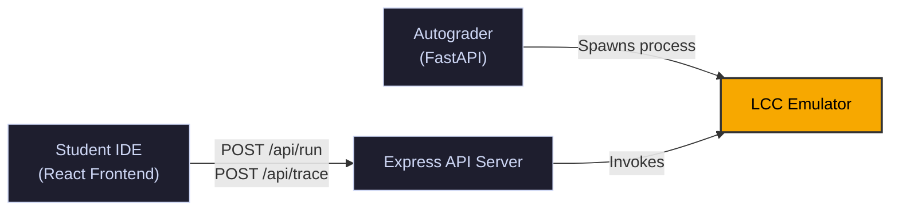
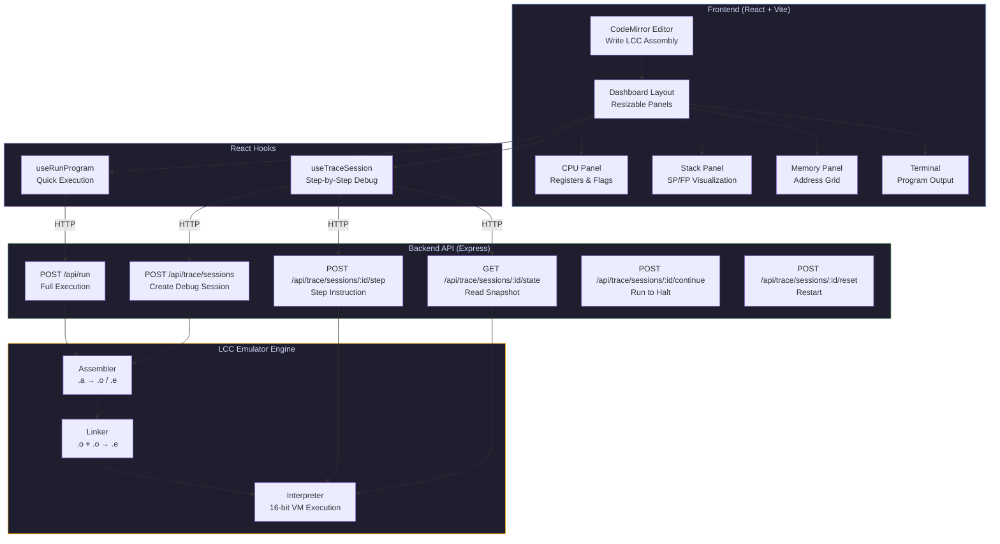
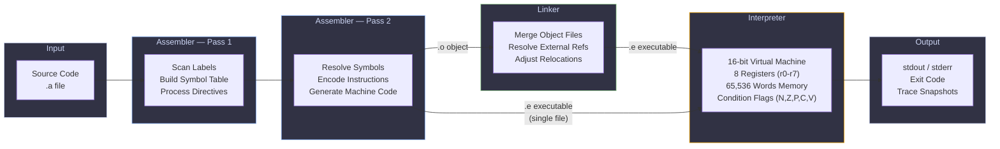
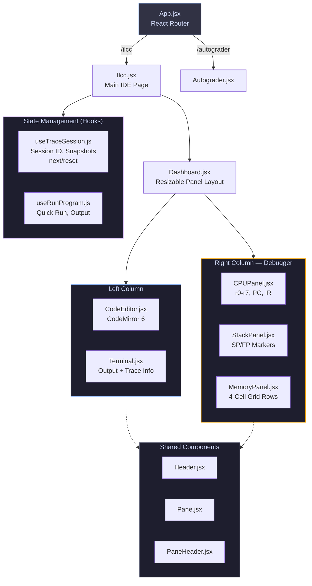
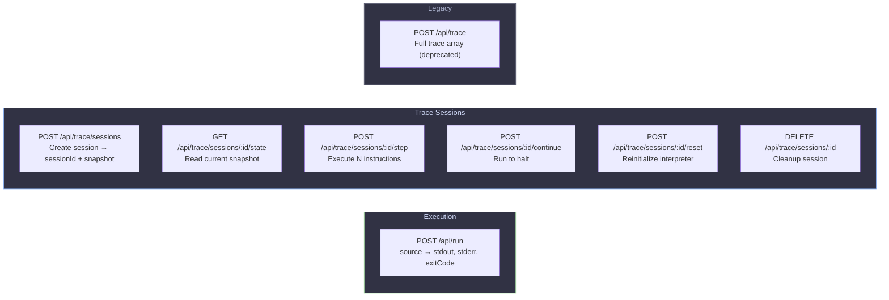
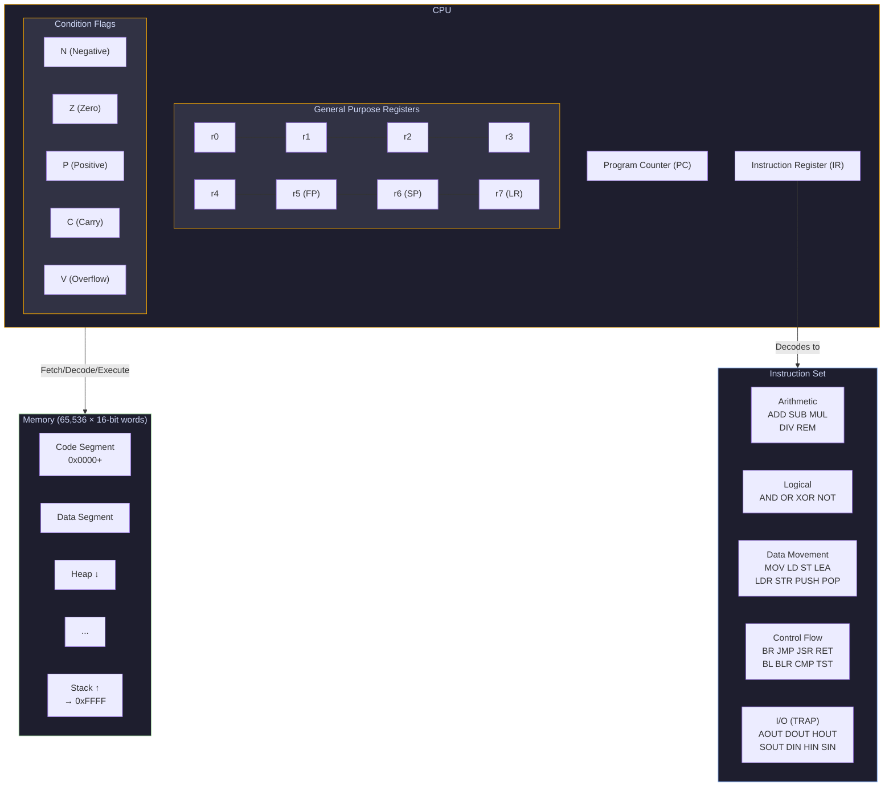
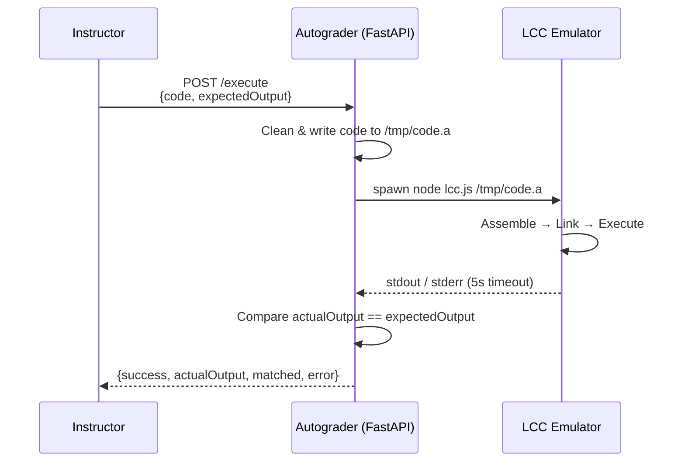

# WebLCC — ILCC Web Emulator & Automated Grading System

A full-stack web platform for teaching assembly language programming using the **Low Cost Computer (LCC)** architecture. Students write, run, and debug LCC assembly in a browser-based IDE with real-time CPU/memory/stack visualization, while instructors leverage automated grading powered by the same emulator.

---

## Project Origin and Team Structure
This project started from a classroom need raised by **Charlie**, professor of Assembly at **SUNY New Paltz**:
- He wanted an interactive way to teach assembly live during lecture.
- He also wanted students to be able to run assembly code easily for labs and projects without local setup friction.

Team organization:
- Total team size: **5 members**
- Split into **2 groups**:
- **Group 1 (3 members):** Main WebLCC IDE/frontend + trace backend integration
- **Group 2 (2 members):** Autograder backend flow and submission evaluation path
- Both groups were aligned around one shared rule: use the **same emulator core** for consistent behavior.

---

## Project Goal
ILCC provides:
1. An interactive web IDE for writing and tracing LCC assembly programs.
2. An automated grading path that executes student submissions against expected output.

Core principle: **both paths use the same emulator core**, so classroom behavior and autograder behavior stay consistent.

## The Problem
Toolchain friction was the starting issue:
- Students had different OS setups (macOS, Windows, Linux) and inconsistent local environments.
- Assembly toolchain setup was error-prone and took class time away from learning.
- Feedback loops were slow (edit -> compile -> run -> inspect), especially for beginners.
- Grading consistency was hard when local runtime behavior differed from grader behavior.

## Solution
- A browser-based ILCC editor experience for writing and tracing LCC code.
- A main backend that manages stateful trace sessions and snapshot APIs.
- A shared emulator core (assembler/interpreter) used by both IDE runtime and autograder.
- A grading backend path that executes and compares submissions consistently.

---

## Core Design Principle

Both the **interactive IDE** and the **autograder** execute student code through the **exact same emulator**, guaranteeing consistent behavior, deterministic output, and fair grading.



---

## Technology Stack

| Layer | Technology | Purpose |
|-------|-----------|---------|
| **Frontend** | React 18, Vite 7, CodeMirror 6 | IDE, editor, visualization |
| **Backend API** | Node.js, Express 4 | REST API for execution & tracing |
| **Emulator** | Custom JavaScript | Assembler, Linker, Interpreter |
| **Autograder** | Python 3, FastAPI | Automated submission grading |
| **Testing** | Jest | Unit, integration, and E2E tests |

---

## System Architecture


---

## High-Level Architecture



---

## Assembly-to-Execution Pipeline

The emulator processes LCC assembly through a multi-stage pipeline:



---

## Frontend Component Architecture



---

## API Endpoints



---

## LCC Virtual Machine Architecture



---

## Autograder Flow



---

## Project Structure

```text
web_ilcc/
├── package.json                        # Root workspace (concurrently dev)
├── weblcc/                             # React + Vite frontend
│   ├── src/
│   │   ├── App.jsx
│   │   ├── main.jsx
│   │   ├── pages/
│   │   │   ├── Ilcc.jsx
│   │   │   └── Autograder.jsx
│   │   ├── components/
│   │   ├── hooks/
│   │   └── constants/
│   ├── vite.config.js
│   └── package.json
├── backend/
│   ├── weblcc-backend/
│   │   ├── server.js
│   │   └── package.json
│   ├── autograder-backend/
│   │   ├── main.py
│   │   └── test_api.py
│   └── emulator/
│       └── src/core/
│           ├── assembler.js
│           ├── interpreter.js
│           ├── linker.js
│           └── lcc.js
└── docs/
    └── system-architecture.png
```

---

## Getting Started

### Prerequisites
- Node.js (v18+)
- Python 3.10+ (for autograder only)

### Main WebLCC (Frontend + Main Trace Backend)
From the repository root:

```bash
npm install
npm run dev
```

This starts both:
- Frontend (Vite)
- Main trace backend (`backend/weblcc-backend`) on port `3002`

### Autograder Backend (FastAPI)
Open a second terminal:

```bash
cd backend/autograder-backend
python3 -m pip install fastapi uvicorn pydantic
python3 -m uvicorn main:app --reload --port 8000
```

Autograder endpoint:
- `POST http://127.0.0.1:8000/execute`

### Emulator CLI (standalone)

```bash
cd backend/emulator

# Assemble and execute
node src/core/lcc.js demos/demoA.a
```

### Running Tests

```bash
cd backend/emulator
npm test
```

---

## License

This project is intended for academic and instructional use.
