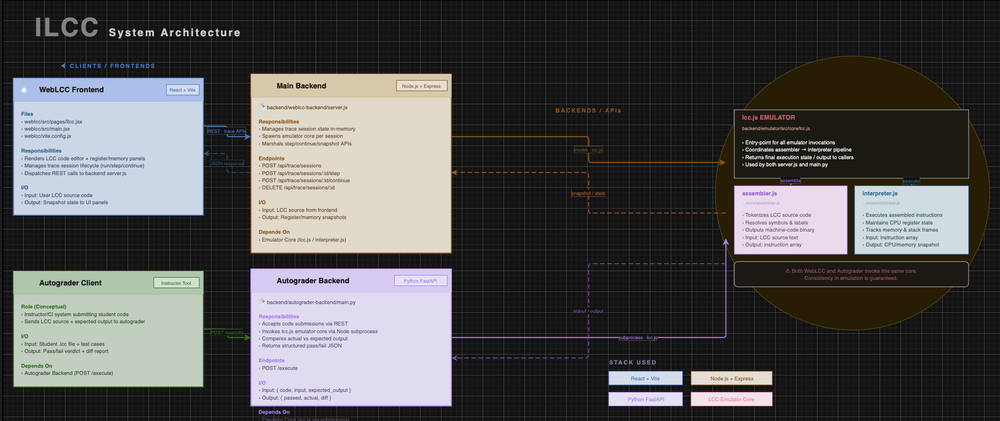
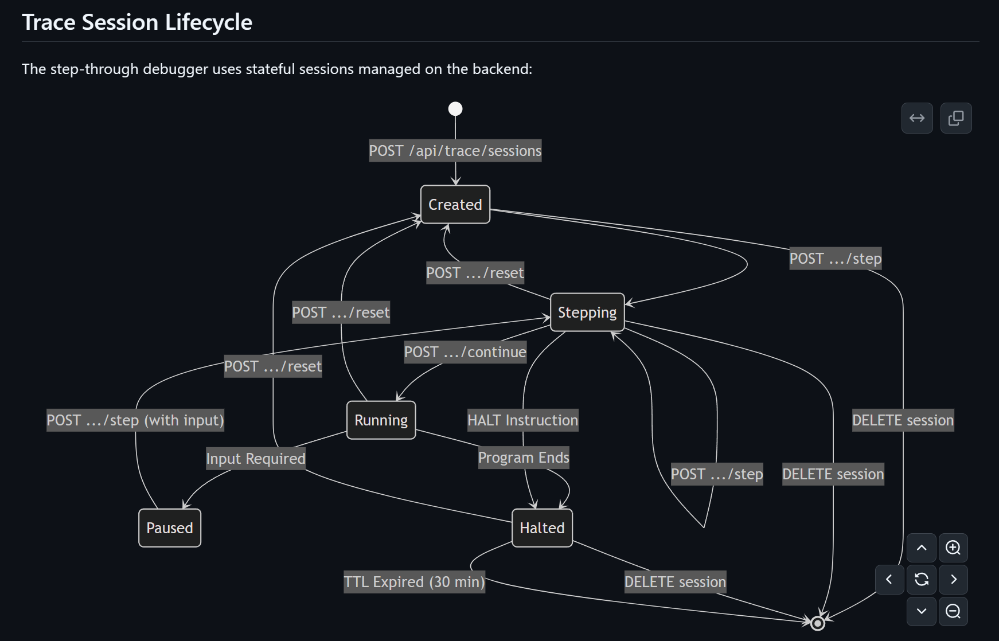

# ILCC Web Emulator and Automated Grading System

## Project Origin and Team Structure
This project started from a classroom need raised by **Charlie**, professor of Assembly at **SUNY New Paltz**:
- He wanted an interactive way to teach assembly live during lecture.
- He also wanted students to be able to run assembly code easily for labs and projects without local setup friction.

Team organization:
- Total team size: **5 members**
- Split into **2 groups**:
  - **Group 1 (3 members):** Main WebLCC IDE/frontend + trace backend integration
  - **Group 2 (2 members):** Autograder backend flow and submission evaluation path
- Both groups were aligned around one shared rule: use the **same emulator core** for consistent behavior.

## Project Goal
ILCC provides:
1. An interactive web IDE for writing and tracing LCC assembly programs.
2. An automated grading path that executes student submissions against expected output.

Core principle: **both paths use the same emulator core**, so classroom behavior and autograder behavior stay consistent.

## The Problem
Toolchain friction was the starting issue:
- Students had different OS setups (macOS, Windows, Linux) and inconsistent local environments.
- Assembly toolchain setup was error-prone and took class time away from learning.
- Feedback loops were slow (edit -> compile -> run -> inspect), especially for beginners.
- Grading consistency was hard when local runtime behavior differed from grader behavior.

## Solution
- A browser-based ILCC editor experience for writing and tracing LCC code.
- A main backend that manages stateful trace sessions and snapshot APIs.
- A shared emulator core (assembler/interpreter) used by both IDE runtime and autograder.
- A grading backend path that executes and compares submissions consistently.

## System Architecture



## Trace Session Lifecycle


### How tracing works 
1. Frontend creates a trace session (`POST /api/trace/sessions`).
2. Backend keeps stateful session data in memory.
3. Frontend requests next transitions (`.../step`, `.../continue`).
4. Backend returns snapshots (registers, memory, flags, stack, line context).
5. Session ends by halt, delete, or TTL expiration.

## Features
- Syntax-highlighted editor for assembly instructions/labels/immediates.
- Live terminal output panel for program I/O.
- Stateful trace mode with register/memory/stack/flags visualization.
- Forward tracing controls for guided instruction flow.
- Backend API snapshots that keep UI deterministic.
- Autograder execution path using the same emulator core.

## Repository Map (Major Components)

### Main Web IDE Frontend
- `weblcc/src/pages/Ilcc.jsx`
- `weblcc/src/main.jsx`
- Responsibilities:
  - Code editor + terminal UI
  - Trace controls
  - Panel rendering from backend snapshots

### Main Web Backend (Trace APIs)
- `backend/weblcc-backend/server.js`
- Responsibilities:
  - Trace session lifecycle management
  - Step/continue orchestration
  - Snapshot payload formatting for UI

### Shared Emulator Core (Single Source of Truth)
- `backend/emulator/src/core/assembler.js`
- `backend/emulator/src/core/interpreter.js`
- `backend/emulator/src/core/lcc.js`
- Responsibilities:
  - Assemble LCC source
  - Execute instructions
  - Produce runtime state + output

### Autograder Backend
- `backend/autograder-backend/main.py`
- Responsibilities:
  - Accept code submissions
  - Execute via emulator path
  - Compare actual vs expected output

## APIs Used in Demo

### Main Backend
- `POST /api/trace/sessions`
- `POST /api/trace/sessions/:id/step`
- `POST /api/trace/sessions/:id/continue`
- `DELETE /api/trace/sessions/:id`

### Autograder Backend
- `POST /execute`

## Technology Stack
- Frontend: React + Vite
- Main API Backend: Node.js + Express
- Autograder API Backend: Python + FastAPI
- Emulator Core: Custom LCC assembler/interpreter runtime (Node)

## Scaling 
- Containerized execution workers for stronger isolation.
- Job queue model for compile/run/grade requests.
- Horizontal scaling of API and worker tiers.
- Multi-user session partitioning and rate limiting.
- Centralized observability for trace + grading pipelines.

## Future Roadmap
- Additional architecture targets / instruction sets.
- Richer debugger features (watch expressions, breakpoints revisit, timelines).
- Better educational UX modes and guided explanations.
- Instructor analytics and assignment-level grading dashboards.
- CI-backed regression suites for emulator correctness.
- Modular so that future developers can expand on the project

## Run Instructions

### Main WebLCC (Frontend + Main Trace Backend)
From the repository root:

```bash
npm install
npm run dev
```

This starts both:
- Web frontend (Vite)
- Main trace backend (`backend/weblcc-backend`) on port `3002`

### Autograder Backend (FastAPI)
Open a second terminal:

```bash
cd backend/autograder-backend
python3 -m pip install fastapi uvicorn pydantic
python3 -m uvicorn main:app --reload --port 8000
```

